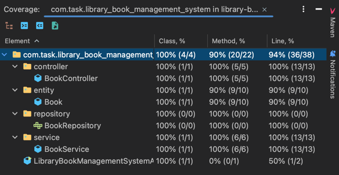

## Task: Create a Library Book Management System

### Details:

1. **Create a Spring Boot Project:**

   - Use Spring Initializr to create a new Spring Boot project.
   - Select dependencies: Spring Web, Spring Data JPA, H2 Database (or MySQL), Spring Boot DevTools.

2. **Create an Entity for Book:**

   - Create a `Book` class with the following fields:
      - `id` (Long)
      - `title` (String)
      - `author` (String)
      - `isbn` (String)
      - `publishedDate` (LocalDate)

3. **Create a Repository:**

   - Create an interface `BookRepository` that extends `JpaRepository<Book, Long>`.

4. **Create a Service Layer:**

   - Create a `BookService` class with methods for adding, updating, deleting, and finding books.

5. **Create a Controller:**

   - Create a `BookController` class with endpoints for managing books:
      - `GET /books` - Retrieve all books.
      - `GET /books/{id}` - Retrieve a book by ID.
      - `POST /books` - Add a new book.
      - `PUT /books/{id}` - Update a book by ID.
      - `DELETE /books/{id}` - Delete a book by ID.

6. **Test the System:**

   - Unit test coverage.

     

   - Use Postman or other tools to test the created API.

     
